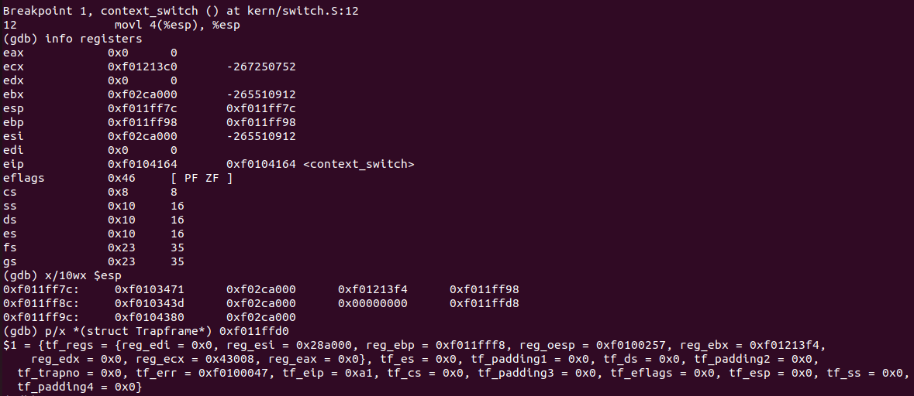

# sched

Lugar para respuestas en prosa, seguimientos con GDB y documentación del TP.

## Ejecucion tests con make grade

## Ejecucion tests con make grade USER_PR=1

## Stack paso a paso

context_switch:
- 1) movl 4(%esp), %esp

- 2) popal

- 3) pop %es

- 4) pop %ds

- 5) addl $8, %esp

- 6) iret

## Explicacion y descripcion de la lógica de la implementación en el scheduler por prioridades

Se decidio desarrollar el scheduler de prioridades como un Lottery Scheduler, el cual cuenta con una implementacion basada en el proportional share. Este scheduler consiste en el asignado de "tickets" a cada proceso que representan su prioridad, donde cuanto mayor sea la cantidad de boletos, mayor será la chance de que el proceso sea ejecutado. Para definir el proceso a correr, se realiza un sorteo entre los boletos disponibles y el proceso que cuente con el ticket escogido sera el ejejutado (en caso de estar disponible).
Este método de scheduler por prioridad no garantiza tiempos de ejecución fijos para ningun proceso, pero asegura que, generalmente sean los procesos con mas tickets los que mas veces se ejecuten, manteniendo un balance en la asignación de recursos.
Este enfoque cuenta con la ventaja de evitar que se genere starvation en los procesos de baja prioridad, debido a que cuentan con chances siempre de ser ejecutados.

En esta implementación se asignan inicialmente la misma cantidad de boletos a cada proceso, contando con STARTING_TICKETS (en env.c). Y se les descuenta un ticket cada vez que son ejecutados. Tal como se menciono anteriormente, s realiza un sorteo para decidir el proceso a ejecutar, para este caso se utiliza una funcion getRandom() a la que se envia la suma de todos los tickets que tengan los procesos y la función devuelve el ticket ganador.

## Documentación utilizada

- OSTEP, capítulo 7: Scheduling: Introduction (PDF)
- OSTEP, capítulo 9: Scheduling: Proportional Share (PDF)